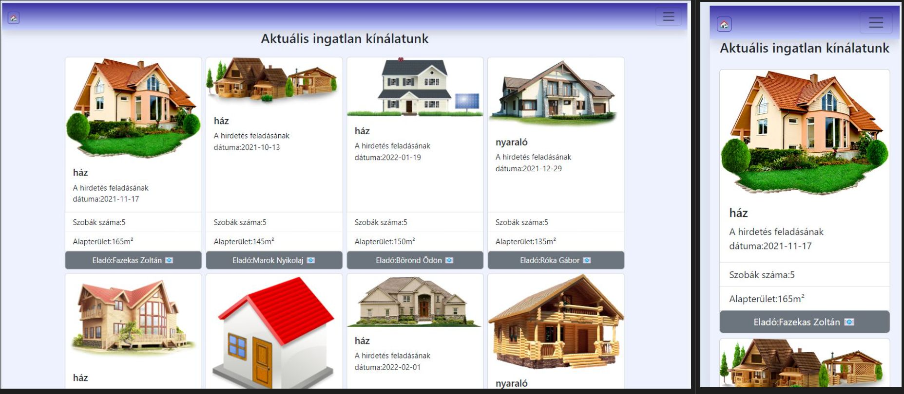

# React + Vite project - vizsgafeladat

## Ingatlanok

Egy ingatlanok értékesítésével foglalkozó vállalkozás weboldalát kellene befejezni, az alábbi követelmények szerint:

- A félig kész weboldal egy  React – Vite projekt, **pnpm** csomagkezelővel létrehozva
- A félig kész projektet innen kell klónozni saját gépre egy üres munkakönyvtárba: [link](https://github.com/mkatay/JF_Kando_vizsga_forras.git)

- A projekt tartalmaz pár automata tesztesetet is, melyek a Vitest keretrendszerrel vannak megvalósítva. A test mappa alatt találhatóak és ezeket nem kell/nem szabad módosítani.
A sikeres megoldás esetén minden teszt helyesen le fog futni.A tesztesetek futtatása:
    > pnpm run test
- a munkát egy GitHub repoba kell feltölteni és a repo URL-jét leadni
- a repo neve **JF_vizsga20240413** legyen
- a repo tartalmazzon egy **Readme.md** fájlt amelyben szerepelnek az alábbi adatok:
  - a publikált produktum URL-je
  - a vizsgázó neve
- A **package.json** fájl tartalmazza a feladatok megoldásához szükséges függőségeket, új csomag telepítése nem szükséges (de megengedett).
- A tesztesetek sikeres futtatása szükséges, de nem elégséges feltétele a feladatok megoldásának, az alkalmazásnak a szöveges leírásnak is meg kell felelnie.
- Az elkészített programkódnak a funkcionalitás mellett a tiszta kód elveinek is meg kell felelnie – nehezen áttekinthető kódért pontlevonás, teljesen olvashatatlan kódért pedig akár 0 pont is járhat.
  
### 1.feladat- Az alkalmazás főoldalának a kialakítása

- Készítsen egy új komponenst a főoldal számára, a neve legyen: **Home.jsx**
- Állítsa be, hogy a „/” route ezt a komponenst használja.
- a főoldal szerkezete/szövege a minta szerint legyen kialakítva, betartva az alábbiakat:
  - a főoldalt tartalmazó tároló szélessége ne legyen **1200px** -nél nagyobb
  - tartalmazzon 3 szemantikus elemet: **header, main** és **footer**
  - a header-ben legyen egy **egyes szintű címsor** a mintán látható szöveggel
  - a header magassága legyen a viewport magasságának 40%-a és hátérképnek állítsa be a **public** mappa alatt található **background.png** -t
  - a main tartalmazzon egy **négyes szintű címsort** a minta szerint és a három különböző ingatlan kategóriát szemléltetve egy-egy képpel. A képek amiket meg kell jelenítenie a **public** mappában vannak és a következőek:
      - a ház kategóriához a  **haz.jpg**
      - a lakás kategóriához a **panel.jpg**
      - a nyaraló kategóriához a  **nyaralo.jpg**
  - a footer elemben levő bekezdés tartalma a minta szerinti szöveget tartalmazza
  - a főoldal formázásához használhatja a bootstrap keretrendszert is de nem kötelező
  - a főoldalon használja a következő színeket:**#c7d2fe**, **#eef2ff**, **#3730a3** a minta szerint.
  

## 2.feladat- Ingatlanok bemutatása

Készítse el az ingatlanokat bemutató oldalt, a **Properties.jsx** komponensben.
Az adatok a **data.js** fájlban találhatóak a **properties** tömbben.
Olvassa be az adatokat a tömbből és jelenítse meg a minta szerint ebben a komponensben.
Egy-egy ingatlant egy-egy kártyában jelenítsen meg. A kártya legyen egy külön komponens, a neve: **SinglePropertie.jsx** .
A **SinglePropertie** komponensben megjelenítendő az ingatlan minden egyes adata, jellemzője, a minta szerint.

### 3.feladat- Kapcsolat oldal kialakítása

- Készítsen egy új komponenst, a neve legyen **Contact.jsx**.
- Valósítsa meg a routingolást, hozzon létre egy **contact** route-t ennek a komponensnek.
- Egészítse ki a menüt ezzel az új **Kapcsolat** oldallal a minta szerint:

A **Contact.jsx** komponenst az alábbiakat sfigyelembe véve kell megvalósítani:
- tartalmazzon címsort a minta szerint
- tartalmazzon egy űrlapot a minta szerint
- legyen egy  **email** típusú mezője, melyben egy email címet lehessen megadni
- legyen egy **textarea** mező, melyben egy többsoros szöveget lehessen megadni
- legyen egy **submit** típusú gomb (button), **Küldés** felírattal
- A „Küldés” gomb segítségével el kell tárolni a felhasználó által beírt adatokat egy objektumba
- Az űrlapot nem szükséges validálni, feldolgozni
- a **Küldés** gombra való kattintáskor, a submit esmény bekövetkeztekor az űrlapadatokat el kell tárolni egy olyan objektumba,  melynek van  **email**, **message** és **timestamp** attribútuma, a timestamp értéke legyen az aktuális időbélyeg
- az így létrehozott objektumot jelenítse meg a konzolban

### 4.feladat- verziókezelés, GitHub repository létrehozása

### 5.feladat- publikálás
 
### 6.feladat - tiszta kód elvének a betartása
